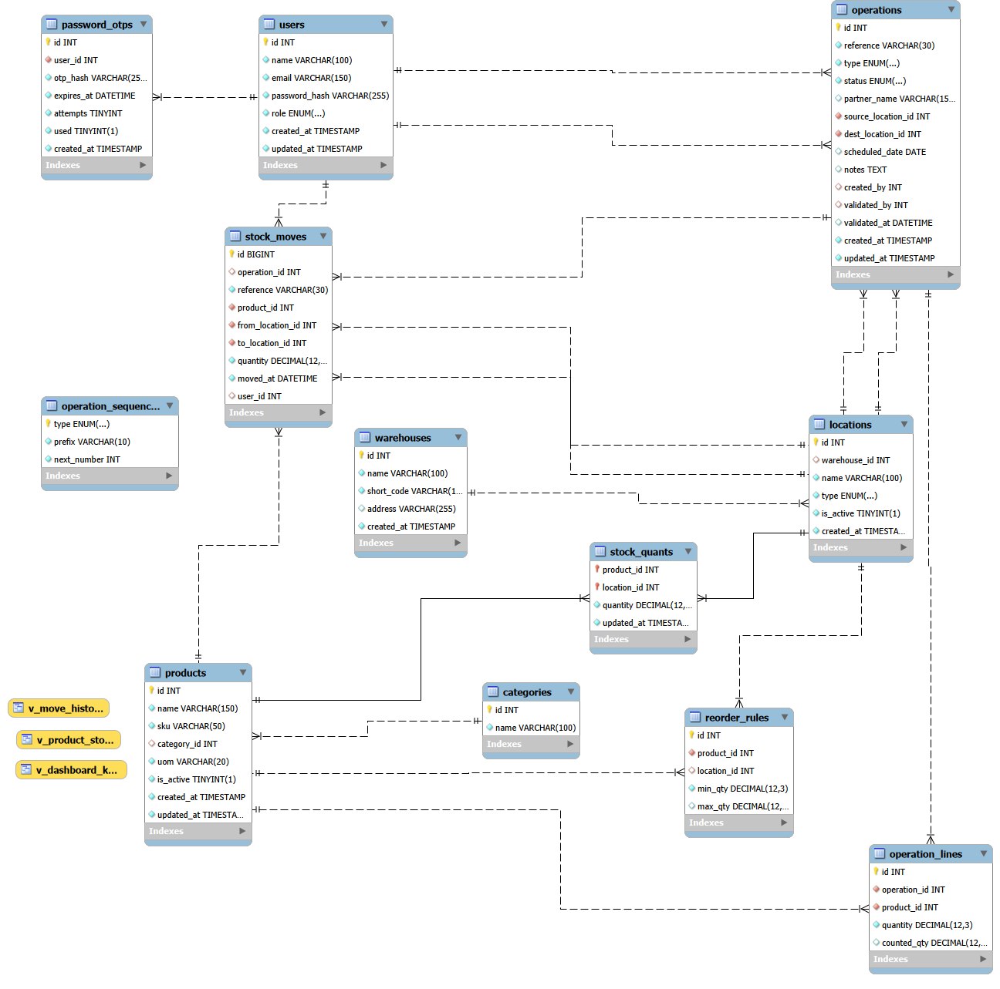

# StockSense

A modular **Inventory Management System** that replaces manual registers and Excel sheets with one real-time app for **Inventory Managers** (incoming and outgoing stock) and **Warehouse Staff** (transfers, picking, shelving and counting).

**Stack:** React 19 + Vite + Tailwind CSS · Node.js + Express · **MySQL 8** · JWT auth · Nodemailer (SMTP) for OTP email. No paid third-party APIs.

---

## What it does

| Problem statement | In StockSense |
|---|---|
| Sign up / log in, OTP password reset, then the Inventory Dashboard | Passwords hashed with bcrypt, JWT sessions, 6-digit OTP by email (hashed, 10-minute expiry, 5 attempts, single use) |
| Dashboard KPIs | Products in stock · Low / out of stock · Pending receipts · Pending deliveries · Internal transfers scheduled |
| Dynamic filters | Document type, status, warehouse or location, product category, date |
| Products | Create/update with name, SKU, category, unit of measure and optional initial stock; stock per location; categories; reordering rules |
| **Receipts** | Create → add supplier and products → quantities → **Validate → stock increases** |
| **Delivery orders** | Pick → Pack → **Validate → stock decreases**; refused if there isn't enough stock at the source |
| **Internal transfers** | Warehouse → production floor, rack → rack, warehouse → warehouse; total unchanged, location updated |
| **Stock adjustments** | Choose product and location → enter counted quantity → difference applied and logged |
| Move history | Every change is a row in the stock ledger (who, when, from → to, quantity) |
| Alerts, multi-warehouse, SKU search | Low-stock alerts with suggested reorder quantity, any number of warehouses and locations, global SKU search |
| Settings, profile | Warehouses and locations (managers), My Profile, Logout |

**Roles:** everyone can create and process receipts, deliveries, transfers and adjustments. Only **Inventory Managers** can change products, categories, reorder rules, warehouses and locations. The API enforces this, not just the UI.

## How stock moves

Every stock change is a move **from one location to another**, including virtual locations (`Vendor`, `Customer`, `Inventory Loss`):

| Document | From → To | Effect on stock |
|---|---|---|
| Receipt | Vendor → warehouse location | + quantity |
| Delivery | warehouse location → Customer | − quantity |
| Internal transfer | location → location | total unchanged |
| Adjustment | location ↔ Inventory Loss | counted − recorded |

Stock only changes on **Validate**. That one database transaction locks the source stock rows, refuses the whole document if any line is short (nothing is written), then updates `stock_quants` (balances) and inserts `stock_moves` (the ledger) together, so the two can never disagree.

Documents go **Draft → Ready** (or **Waiting** when a delivery or transfer doesn't have the stock yet) **→ Done**, or **Canceled**. References are generated per type: `WH/IN/0001`, `WH/OUT/0001`, `WH/INT/0001`, `WH/ADJ/0001`.

## Database

MySQL 8, designed in MySQL Workbench: 12 tables and 3 views. Details are in [`database/README.md`](database/README.md).



- **Stock:** `stock_quants` (current balance per product and location, `CHECK quantity ≥ 0`) and `stock_moves` (append-only ledger)
- **Documents:** `operations`, `operation_lines`, `operation_sequences` (reference numbers, row-locked)
- **Catalogue:** `products`, `categories`, `reorder_rules`
- **Places:** `warehouses`, `locations`
- **Accounts:** `users`, `password_otps`
- **Views:** `v_product_stock` (on-hand + low/out state), `v_dashboard_kpis`, `v_move_history`

## Run it locally

**Needs:** Node.js 18+, MySQL 8 (MySQL Workbench is easiest).

1. **Database.** In MySQL Workbench, run [`database/schema.sql`](database/schema.sql), then [`database/seed.sql`](database/seed.sql). This loads demo warehouses, products and documents. Re-running both resets the data.
2. **Backend** (port 5001):
   ```bash
   cd backend
   cp .env.example .env      # set DB_PASSWORD and JWT_SECRET (see comments in the file)
   npm install
   npm run dev
   ```
   It should print `Connected to MySQL database "stocksense"`. Leave the SMTP settings empty to get OTP emails in a free Ethereal test inbox (the code is also shown on screen in development), or add a Gmail app password to send real email.
3. **Frontend** (port 5173), in a second terminal:
   ```bash
   cd frontend
   cp .env.example .env
   npm install
   npm run dev
   ```
4. Open **http://localhost:5173** and **Create an account** (choose Inventory Manager to try everything).

No MySQL? Set `VITE_DATA_SOURCE=mock` in `frontend/.env` to run the frontend on a browser-only copy of the seed data. See [`frontend/README.md`](frontend/README.md).

## Try the example from the problem statement

After running the seed, Steel Rods 12mm starts at **77 kg**.

1. **Receipts → New receipt:** into WH/Stock, 100 kg Steel Rods → Save as draft → **Validate** → **+100**
2. **Internal Transfers → New transfer:** WH/Stock → WH/Production Floor, 100 kg → Save as draft → Mark as to do → **Validate** → total unchanged, location updated
3. **Delivery Orders → New delivery:** ship from WH/Production Floor, 20 kg → Save as draft → Mark as to do → **Pick items** → **Pack items** → **Validate** → **−20**
4. **Inventory Adjustment:** WH/Production Floor, Steel Rods, counted 3 kg less than recorded → **Apply** → **−3**
5. **Move History** shows the four moves: +100, 0, −20, −3.

The same flow runs automatically against the API:

```bash
cd backend
node scripts/verify-flow.mjs     # backend must be running; writes real documents, so use demo data
```

It checks every step above, plus that a delivery bigger than the stock is refused with nothing written.

## Project structure

```
backend/     Express API: routes → controllers → services (stock changes in transactions), JWT auth, Nodemailer
database/    schema.sql, seed.sql, ER diagram, setup guide
docs/api.md  Every endpoint, query parameter and response shape
frontend/    React app: pages, app shell, UI components, API client (+ optional mock data)
design/      Early clickable UI mockup
plan.md      Planning notes: stack choices and why, schema, team split
```

## Team

- Husanpreet Singh ([@Hussnn18](https://github.com/Hussnn18))
- Harshpreet Singh
- Jashan Choudhary ([@jashanchoudhary778](https://github.com/jashanchoudhary778))
